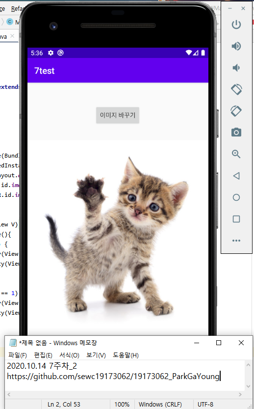

# 19173062 박가영

## 1주차 과제 2020.09.02

## 2주차 과제 2020.09.09
   </img>

## 3주차 과제 2020.09.16
   </img>
   
## 4주차 과제 2020.09.23
   </img>

## 7주차 과제 2020.10.14
   </img>
   </img>
   
## 9주차 과제 2020.10.28
   </img>
   </img>   
   </img>
   </img>   
   
## 10주차 과제 2020.11.05
   </img>
   </img>
   
## 11주차 과제 2020.11.12
   </img>
   </img>
   </img>

## 12주차 과제 2020.11.17
   </img>
   </img>
   </img>
   
## 기말 고사과제 2020.12.06

### 지하철 정보 검색 서비스 App
 - 로그인 페이지는 지하철icon과 함께 지하철 노선도이미지와 지하철 정보를 검색을 할 수 있는 버튼을 구축 하였습니다.
 - 버튼을 클릭하면 지하철 호선, ID, 역명을 확인 할 수 있습니다.
 - open API로 국토교통부의 API를 사용하였는데 JSON이 아닌 XML파일이어서, 소스 자체에 XML파일을 따로 만들어 적용 시켰습니다.
   

   </img>
   </img>
   

