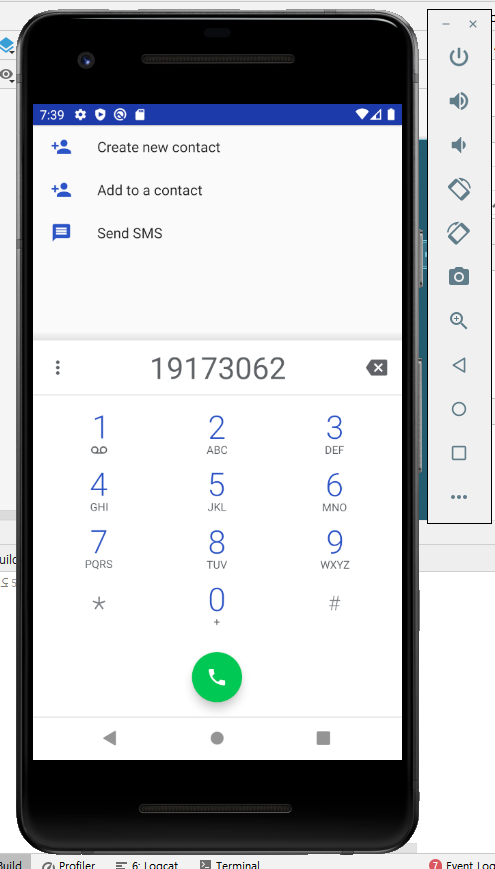

# 19173062 박가영

## 1주차 과제 2020.09.02

## 2주차 과제 2020.09.09
   </img>

## 3주차 과제 2020.09.16
   </img>
   
## 4주차 과제 2020.09.23
   </img>

## 7주차 과제 2020.10.14
   </img>
   </img>
   
## 9주차 과제 2020.10.28
   </img>
   </img>   
   </img>
   </img>   
   
## 10주차 과제 2020.11.05
   </img>
   </img>
   
## 11주차 과제 2020.11.12
   </img>
   </img>
   </img>

## 12주차 과제 2020.11.17
   </img>
   </img>
   </img>
   
## 기말 고사과제 2020.12.06

### 지하철 정보 검색 서비스 APP
 - 지하철 정보 검색 서비스 APP으로 보일 수 있도록 로딩 페이지를 3초 정도 시각화 하였고, 지하철icon과 지하철 이미지를 이용하여 "지하철"어플의 모습을 구현하였습니다.  
 - 로딩 페이지 이후에 로그인 페이지가 뜰 수 있도록 설정하였고, 로그인페이지는 Edit과 버튼을 사용하여 로그인 모양을 구축하였습니다. 또한 지하철 노선도 이미지를 넣어 자칫 심심해 볼 수 있는 화면을 채워넣었습니다. 
 - 로그인 페이지의 Login 버튼을 클릭하면 Textview를 이용하여 open API를 확인 할 수 있도록 구축하였고 새로운 검색 버튼을 클릭하면 다음페이지로 넘어가도록 하였습니다.
 - 새로운 검색페이지는 recycleview와 cardview를 이용하여 open Api가 아닌 item을 추가하여 시각화 하였습니다. 또한 로그인 페이지로 돌아가기를 클릭하면 3초의 로딩페이지가 나왔다가 로그인 페이지가 나올 수 있도록 구축하였습니다.
 - 로그인 페이지의 New Log In 버튼을 클릭하면 마지막에 나왔던 새로운 검색페이지가 나올 수 있도록 Intent하였습니다.
 - *open API로 국토교통부의 API를 사용하였는데 JSON이 아닌 XML파일이어서, 소스 자체에 XML파일을 따로 만들어 적용 시켰습니다.*
   

   </img>
   </img>
   </img>
   </img>
   

